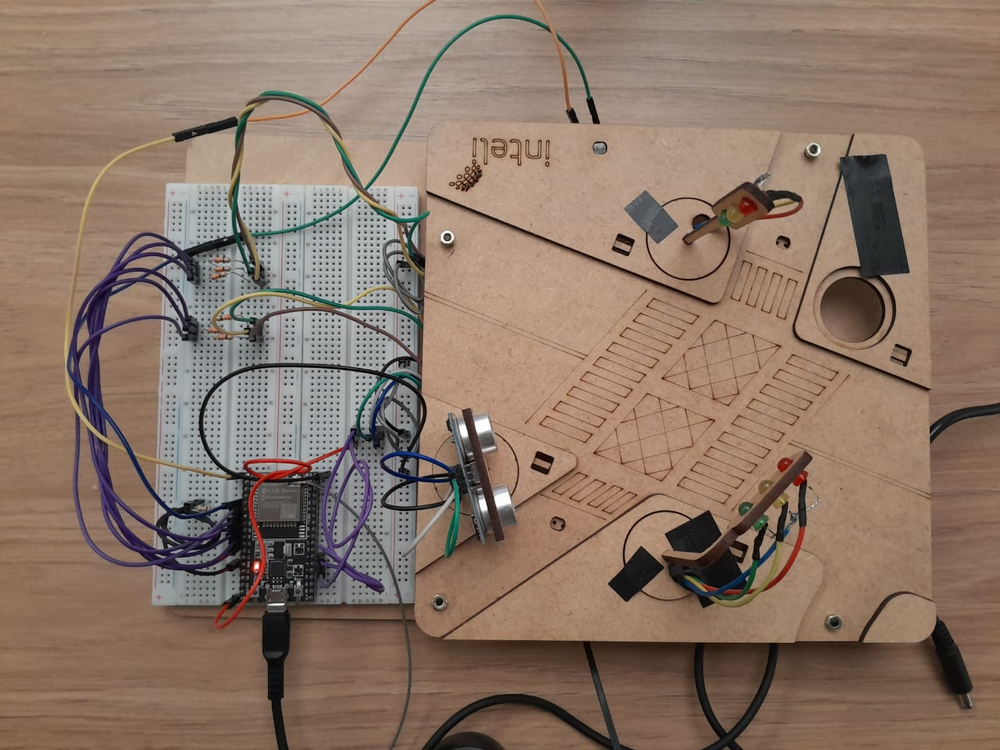
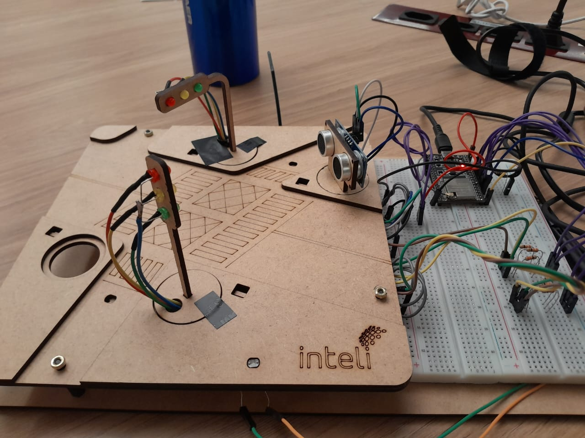
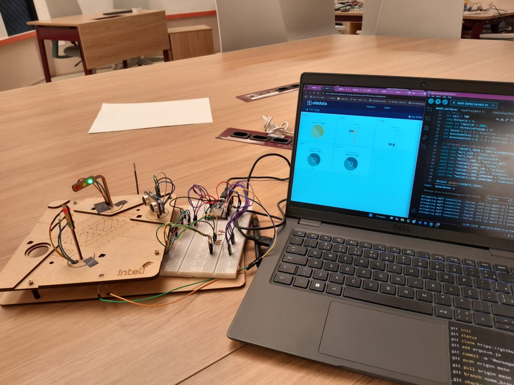
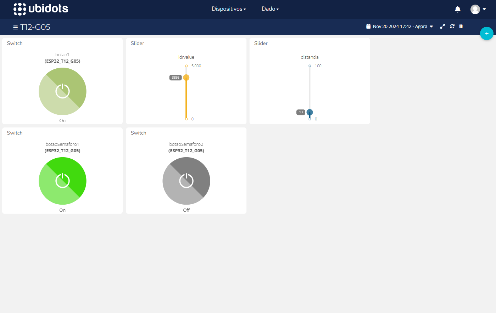

# **Semáforo Inteligente**

Este projeto é um sistema completo para controlar dois semáforos conectados a um ESP32, integrando sensores (LDR e ultrassônico) e comunicação com a plataforma IoT Ubidots. 

<a href="link" target="_blank">Acesse um vídeo mostrando o seu funcionamento.</a>

 

Semáforo 
 
Fonte: Material produzido pelos autores (2024)

 

 

Semáforo 
 
Fonte: Material produzido pelos autores (2024)

 

 

Semáforo 
 
Fonte: Material produzido pelos autores (2024)

 

---

### **Dashboard**

Esse é o dashboard para controlar os botões e visualizar os valores dos sensores através das variáveis.

 

Semáforo 
 
Fonte: Material produzido pelos autores (2024)

 

---
## **Código**
A seguir, tem-se a explicação de todas as etapas do código.
<a href="semaforo.ino">Abrir arquivo do código</a>

### **Bibliotecas Importadas**
1. `WiFi.h`: Permite a conexão do ESP32 a uma rede Wi-Fi.
2. `UbidotsEsp32Mqtt.h`: Integra o ESP32 à plataforma Ubidots via protocolo MQTT, possibilitando a publicação e assinatura de variáveis na nuvem.

---

### **Definição de Pinos e Variáveis**
- **Semáforos:**  
  - Cada semáforo tem três LEDs (vermelho, amarelo e verde) conectados a diferentes pinos digitais.
- **LDR:**  
  - Sensor que mede a intensidade luminosa, conectado a um pino analógico.
- **Sensor Ultrassônico:**  
  - Usa os pinos `trigPin` e `echoPin` para medir a distância de objetos próximos.
- **Variáveis de Controle:**  
  - `botao1`, `botaoSemaforo1` e `botaoSemaforo2`: Controlam estados do sistema e dos semáforos. 
  - `ldrValue` e `distancia`: Guardam leituras dos sensores.
  - `limiarLdr` e `distanciaProxima`: Parâmetros que determinam ações específicas (ex.: ambiente escuro ou objeto próximo).

---

### **Configuração do Wi-Fi e Ubidots**
- As credenciais do Wi-Fi (`WIFI_SSID` e `WIFI_PASS`) permitem conectar o ESP32 à rede.
- As variáveis do Ubidots incluem o token de autenticação, rótulos do dispositivo e nomes das variáveis publicadas ou assinadas.

---

### **Funções Importantes**
1. **`medirDistancia()`**:
   - Controla o sensor ultrassônico para calcular a distância de objetos em centímetros.
   - Usa o tempo de retorno do sinal para determinar a distância.

2. **`callback()`**:
   - Processa mensagens recebidas via MQTT.
   - Atualiza os estados dos botões e controla os LEDs dos semáforos com base nas mensagens recebidas do Ubidots.
   - Quando `botao1` é desativado, todos os LEDs são desligados.

---

### **Função `setup()`**
- **Configuração Inicial:**
  - Define os pinos dos LEDs e sensores como entradas ou saídas.
  - Configura o Ubidots para depuração e define a função de callback para tratar mensagens recebidas.
- **Conexão Wi-Fi:**
  - Estabelece a conexão à rede e exibe o endereço IP do ESP32.
- **Inscrição no Ubidots:**
  - Permite receber atualizações para as variáveis dos botões e semáforos.

---

### **Função `loop()`**
1. **Reconexão ao Ubidots:**
   - Verifica se a conexão está ativa; caso contrário, tenta reconectar e reinscreve-se nas variáveis.
2. **Leitura de Sensores:**
   - Lê valores do LDR e do sensor ultrassônico.
3. **Controle de Semáforos:**
   - **Botão Semáforo 1 Ativado:** Apenas o LED amarelo do semáforo 1 acende, e o semáforo 2 é apagado.
   - **Botão Semáforo 2 Ativado:** Apenas o LED amarelo do semáforo 2 acende, e o semáforo 1 é apagado.
   - **Lógica Automática:**
     - **Ambiente escuro:** Ambos os semáforos ficam amarelos.
     - **Objeto próximo:** Ambos ficam vermelhos.
     - **Cenário normal:** Alterna entre verde, amarelo e vermelho para simular um ciclo de semáforo real.
4. **Envio de Dados para o Ubidots:**
   - Publica os valores de luminosidade (`ldrValue`) e distância (`distancia`) na nuvem para monitoramento remoto.

---

### **Cenários do Sistema**
1. **Modo Manual:**
   - Controlado pelos botões dos semáforos via Ubidots.
2. **Modo Automático:**
   - Baseado em sensores:
     - Luminosidade baixa: Semáforos amarelos.
     - Objeto próximo: Semáforos vermelhos.
     - Ciclo normal: Alternância de estados entre os dois semáforos.

---

### **Resumo**
Este código combina **hardware** (LEDs e sensores) e **software** (conexão Wi-Fi e Ubidots) para criar um sistema inteligente de controle de semáforos. Ele oferece funcionalidades como:
- Controle remoto via IoT.
- Respostas automáticas com base em condições ambientais (luminosidade) e proximidade de objetos.
- Um ciclo dinâmico de semáforo.